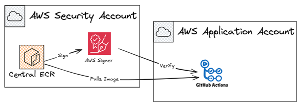

# 🛡️Signing and Verifying AWS Central ECR Images with AWS Signer

This is an extremely basic setup, using a central ECR with a pull through cache from upstream Dockerhub. 

## Prerequisites:
-	Two AWS Accounts in the same AWS Organization. 
-	Github Actions enabled Github repository. 
-	OIDC deployment role for both accounts. 
-	Basic knowledge of Terraform. 

## Holistic view:
### Two AWS Accounts: 
o	Security account: Hosting the central ECR and AWS Signer Profile.
o	Application account: Pulling a base image and verifying its signature. 
### Three Github Actions pipelines in Github Repo: 
o	‘deployinfra.yaml’ to deploy basic infrastructure in Security and Application account. 
o	‘mirror-and-sign.yml’ to pull an image, sign it and push to Central ECR in the Security account.
o	‘pull-and-verify.yaml’ to pull an image from the central ECR and verifying its signature. 
### AWS Services
-	AWS Signer: AWS Signer profile used to perform sign and verify jobs. 
-	ECR: Centralised ECR in the Security account.
-	Pull Through Cache: Provides means of caching images from a upstream registry in a private ECR. 
